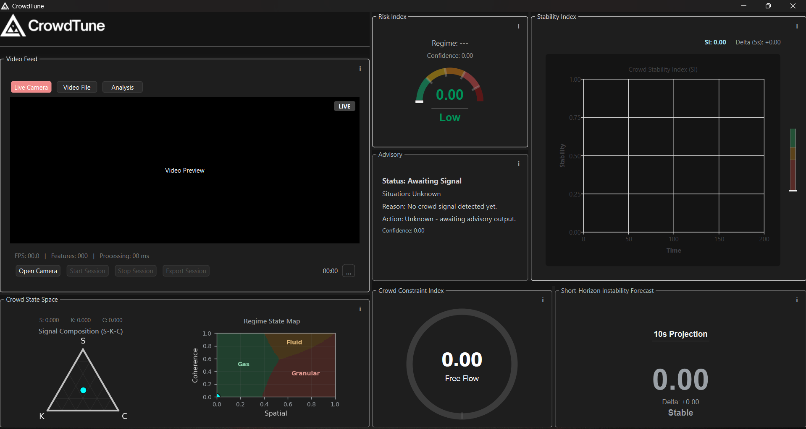
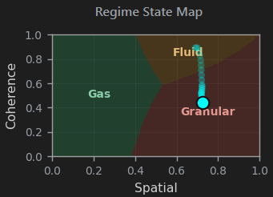
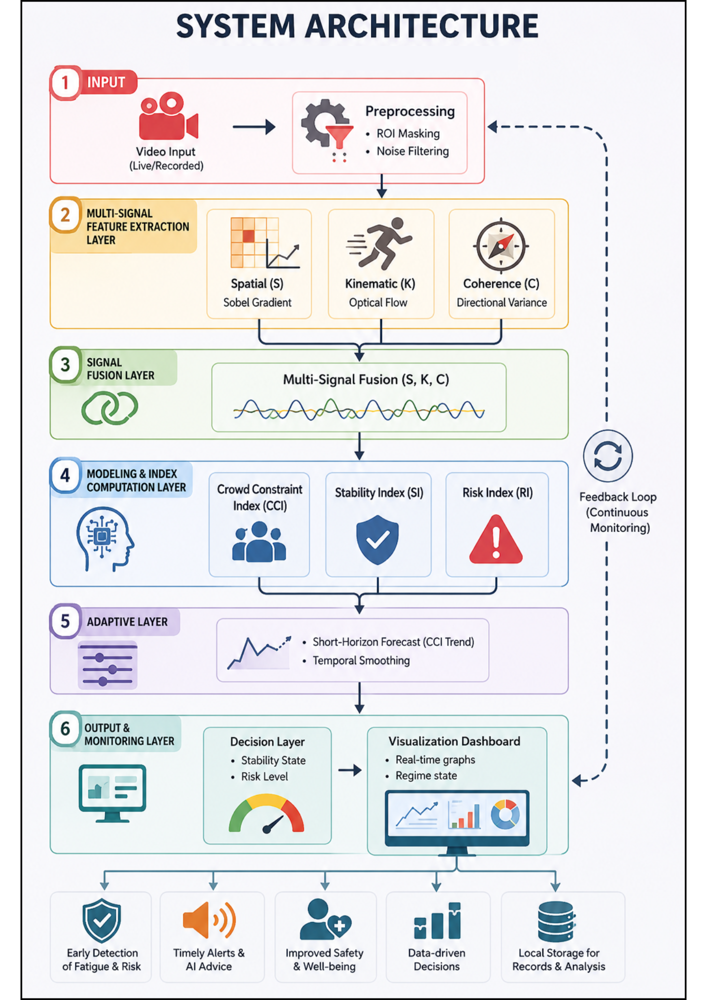

# CrowdTune

Interpretable AI for Preventive Crowd Safety Monitoring

---

## Overview

CrowdTune is a physics-inspired crowd instability analysis framework that models crowd behavior as a continuous structural process using:

- Spatial Constraint (S)
- Kinematic Activity (K)
- Collective Coherence (C)

Unlike conventional crowd monitoring systems that rely primarily on density estimation or anomaly detection, CrowdTune provides interpretable instability analysis, regime transition modeling, and short-horizon forecasting for preventive crowd safety intelligence.

---

## Motivation

Conventional crowd monitoring systems often rely on density estimation, anomaly detection, or reactive event-based surveillance. While effective for observing visible crowd conditions, these approaches may struggle to explain how instability gradually emerges within high-density environments.

CrowdTune addresses this limitation by modeling instability as a continuous structural process driven by spatial constraint, motion behavior, and collective coherence interactions.

---

## Dashboard Preview

### Main Analytical Dashboard



---

### Forecasting Module


---

### Crowd Regime Analysis



---

## System Architecture



---

## Core Features

- Real-time crowd instability monitoring
- Crowd Constraint Index (CCI)
- Stability Index (SI)
- Risk Index (RI)
- Adaptive Kalman-based forecasting
- Gas-like, Fluid-like, and Granular-like regime interpretation
- Real-time analytical dashboard
- Scene masking and region annotation

---

## Crowd Physics Framework

CrowdTune models instability through interaction between:

| Signal | Description |
|---|---|
| Spatial Constraint (S) | Environmental compression and restriction |
| Kinematic Activity (K) | Crowd motion intensity and velocity |
| Collective Coherence (C) | Coordinated movement synchronization |

Composite interaction:

```math
CCI(t) = S(0.4K + 0.6(1 - C))
```

Where:

- \(S\) = Spatial Constraint
- \(K\) = Kinematic Activity
- \(C\) = Collective Coherence

All signals are normalized within \([0,1]\).

---

## Privacy-Aware Design

CrowdTune performs non-identity-based crowd analysis without:

- facial recognition
- biometric identification
- personal identity tracking

The framework focuses on collective crowd dynamics rather than individual identity analysis, supporting privacy-aware crowd safety monitoring.

---

## Experimental Scenarios

| Scenario | Crowd Regime |
|---|---|
| Shibuya Crossing | Gas-like |
| Akron Marathon | Fluid-like |
| Oasis Concert Compression | Granular-like |

---

## Technical Stack

### Programming & Frameworks
- Python
- PyQt6

### Computer Vision
- OpenCV
- Optical Flow (RLOF)
- Shi–Tomasi Feature Detection
- Sobel Gradient Analysis

### Data & Analytics
- NumPy
- Pandas
- Signal Processing
- Time-Series Forecasting

---

## Current Limitations

Current limitations include:

- dependency on fixed surveillance viewpoints
- manual polygon-based scene masking
- single-camera analytical environments
- sensitivity to severe perspective variation

The current implementation is intended as an interpretable analytical prototype for preventive crowd instability monitoring.

---

## Research Focus

Current research directions include:

- Adaptive instability forecasting
- Crowd regime transition analysis
- Preventive crowd safety systems
- Interpretable AI for public-space monitoring
- Physics-inspired crowd dynamics modeling

---

## Research Contribution

CrowdTune contributes an interpretable crowd instability framework that transforms crowd monitoring from passive observation and density estimation toward preventive, explainable, and physics-informed crowd safety intelligence.

---

## Deployment Context

CrowdTune is designed for integration with:

- CCTV infrastructure
- transport surveillance environments
- stadium monitoring systems
- smart city environments
- public safety command centers

The framework currently operates as a desktop-based analytical prototype for research and preventive crowd safety analysis.

---

## Future Work

Potential future enhancements include:

- multi-camera crowd fusion
- depth-aware instability estimation
- transformer-based temporal modeling
- real-time evacuation support
- smart city integration
- adaptive scene understanding

---

## Installation

```bash
git clone https://github.com/hariz-af/CrowdTune.git

cd CrowdTune

pip install -r requirements.txt
```

---

## Repository Structure

```bash
CrowdTune/
│
├── docs/
├── screenshots/
├── src/
├── datasets/
├── results/
└── demo/
```

---

## Research & Academic Engagement

- IEEE International Online Conference (Japan)
- Submitted to Prototype for Humanity (Dubai)

---

## Project Status

Ongoing undergraduate research project focused on interpretable crowd instability modeling, real-time analytics, and preventive crowd safety systems.

---

## Author

Hariz Ahmad Fauzi

Information Technology Undergraduate  
Applied Data Science Major  
Universiti Utara Malaysia (UUM)

Areas of Interest:
Computer Vision • Real-Time Analytics • Applied AI • Intelligent Systems