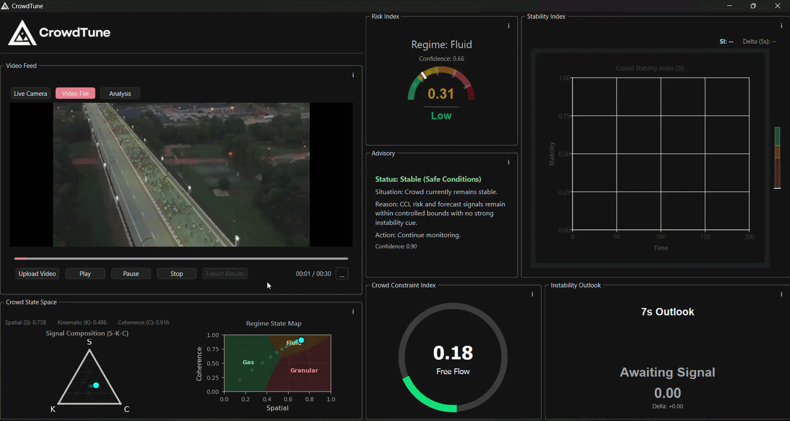
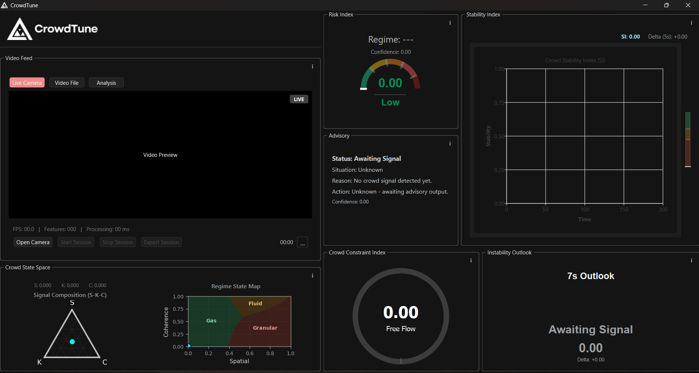
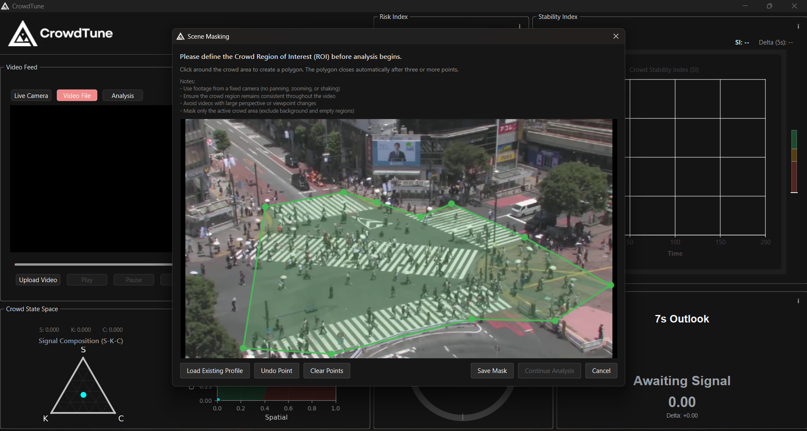
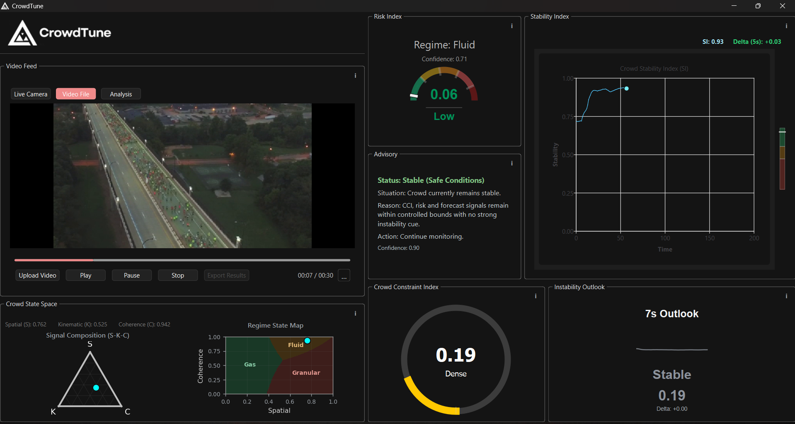
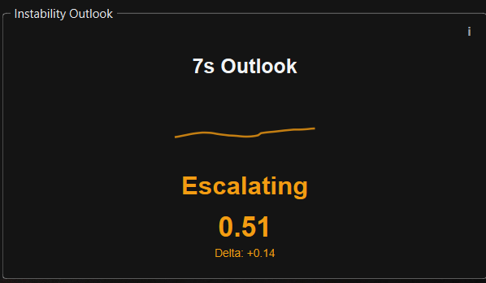
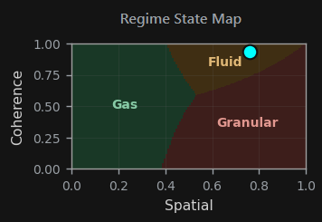
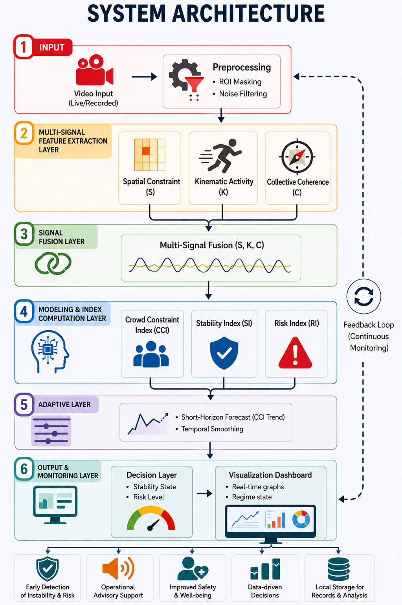

# CrowdTune

Interpretable AI for Preventive Crowd Safety Monitoring

Physics-inspired crowd instability analysis using computer vision, interpretable analytics, and real-time forecasting.

---

> Presented research on interpretable crowd instability modelling at an IEEE International Conference (Japan)
>
> Submitted to Prototypes for Humanity (Dubai)

---

---

## Quick Start

This repository showcases the CrowdTune framework.

The public repository focuses on system architecture, demonstrations, and research outputs. Core implementation components are not publicly distributed.

To explore the project:

1. Review the architecture section
2. Watch the demonstration video
3. Explore dashboard screenshots
4. Read the methodology documentation

---

## Repository Notice

CrowdTune is an ongoing research-oriented analytical framework currently under active development and refinement.

Selected implementation details and analytical formulations are not publicly disclosed at this stage. This repository focuses on the system architecture, capabilities, and high-level framework concepts.

---

## Overview

CrowdTune is a physics-inspired crowd instability analysis framework that models crowd behavior as a continuous structural process using:

- Spatial Constraint (S)
- Kinematic Activity (K)
- Collective Coherence (C)

Unlike conventional crowd monitoring systems that rely primarily on density estimation or anomaly detection, CrowdTune provides interpretable instability analysis, regime transition modeling, and short-horizon forecasting for preventive crowd safety intelligence.

---

## Why CrowdTune Matters

Crowd disasters are often preceded by subtle structural instability, including crowd compression, coherence breakdown, and motion irregularity.

Many existing systems focus on density estimation or anomaly detection, but provide limited explanation of why risk is increasing.

CrowdTune was developed to provide interpretable crowd safety intelligence, helping operators understand how instability emerges before dangerous conditions become visible.

---

## Motivation

Conventional crowd monitoring systems often rely on density estimation, anomaly detection, or reactive event-based surveillance. While effective for observing visible crowd conditions, these approaches may struggle to explain how instability gradually emerges within high-density environments.

CrowdTune addresses this limitation by modeling instability as a continuous structural process driven by spatial constraint, motion behavior, and collective coherence interactions.

---

## System Demonstration

A short demonstration showcasing:

- real-time crowd instability monitoring
- structural signal evolution
- regime interpretation
- short-horizon forecasting behavior

---

## Dashboard Preview

### Main Analytical Interface

---

### Segmentation & Masking

---

### Real-Time Monitoring

---

### Forecasting Module

---

### Crowd Regime Analysis

---

## System Architecture

Input Video
↓
Region Masking
↓
Signal Extraction
↓
Instability Modelling
↓
Forecasting
↓
Dashboard Visualization

The CrowdTune architecture follows a layered analytical pipeline for interpretable instability modeling, forecasting, and regime-aware crowd monitoring.

---

## Core Features

- Real-time crowd instability monitoring
- Interpretable crowd instability indicators
- Short-horizon instability forecasting
- Gas-like, Fluid-like, and Granular-like regime interpretation
- Real-time analytical dashboard
- Scene masking and region annotation

---

## Crowd Physics Framework

CrowdTune models instability through interaction between:

| Signal | Description |
|---|---|
| Spatial Constraint (S) | Environmental compression and restriction |
| Kinematic Activity (K) | Crowd motion intensity and velocity |
| Collective Coherence (C) | Coordinated movement synchronization |

These signals are fused into a set of analytical indicators that estimate structural instability, temporal stability, and operational crowd risk.

The framework emphasizes interpretability by preserving explicit relationships between observable crowd behavior and resulting analytical outputs.

Detailed mathematical formulations are not publicly disclosed.

---

## Privacy-Aware Design

CrowdTune performs non-identity-based crowd analysis without:

- facial recognition
- biometric identification
- personal identity tracking

The framework focuses on collective crowd dynamics rather than individual identity analysis, supporting privacy-aware crowd safety monitoring.

---

## Experimental Scenarios

| Scenario | Crowd Regime |
|---|---|
| Shibuya Crossing | Gas-like |
| Akron Marathon | Fluid-like |
| Oasis Concert Compression | Granular-like |

---

## Validation Highlights

The framework was evaluated using representative crowd scenarios exhibiting distinct structural crowd regimes.

Key observations included:

- Low instability under sparse gas-like conditions
- Stable coordinated flow within fluid-like conditions
- Rising instability and coherence breakdown under granular-like compression

These observations support the interpretation of crowd instability as a structural process rather than a density-only phenomenon.

---

## Technical Stack

### Programming & Frameworks
- Python
- PyQt6

### Computer Vision
- OpenCV
- Optical Flow (RLOF)
- Shi–Tomasi Feature Detection
- Sobel Gradient Analysis

### Data & Analytics
- NumPy
- Pandas
- Signal Processing
- Time-Series Forecasting

---

## Current Limitations

Current limitations include:

- dependency on fixed surveillance viewpoints
- manual polygon-based scene masking
- single-camera analytical environments
- sensitivity to severe perspective variation

The current implementation is intended as an interpretable analytical prototype for preventive crowd instability monitoring.

---

## Research Focus

Current research focuses on interpretable crowd analytics and preventive crowd safety intelligence.

---

## Research Contribution

CrowdTune introduces a physics-inspired framework for modelling crowd instability as a continuous structural process rather than a density-only problem. By combining interpretable crowd signals with real-time analytics and forecasting, the framework aims to support earlier understanding of emerging crowd risk conditions.

---

## Deployment Context

CrowdTune is designed for integration with:

- CCTV infrastructure
- transport surveillance environments
- stadium monitoring systems
- smart city environments
- public safety command centers

The framework currently operates as a desktop-based analytical prototype for research and preventive crowd safety analysis.

---

## Future Work

Potential future enhancements include:

- multi-camera crowd fusion
- depth-aware instability estimation
- transformer-based temporal modeling
- real-time evacuation support
- smart city integration
- adaptive scene understanding

---

## Project Status

Ongoing undergraduate research project focused on interpretable crowd instability modeling, real-time analytics, and preventive crowd safety systems.

---

## Author

Hariz Ahmad Fauzi

Information Technology Undergraduate  
Applied Data Science Major  
Universiti Utara Malaysia (UUM)

Areas of Interest:
Computer Vision • Real-Time Analytics • Applied AI • Intelligent Systems
